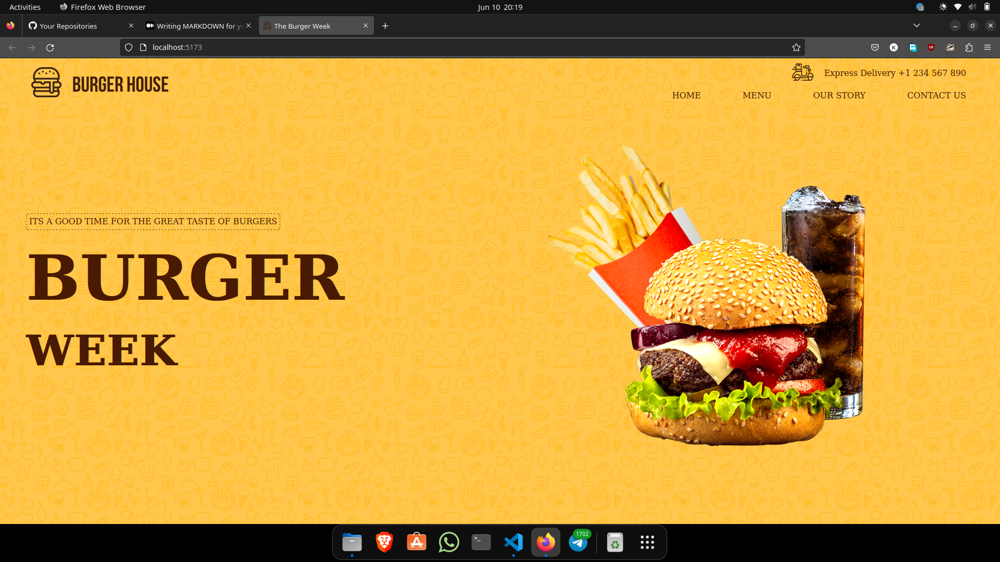
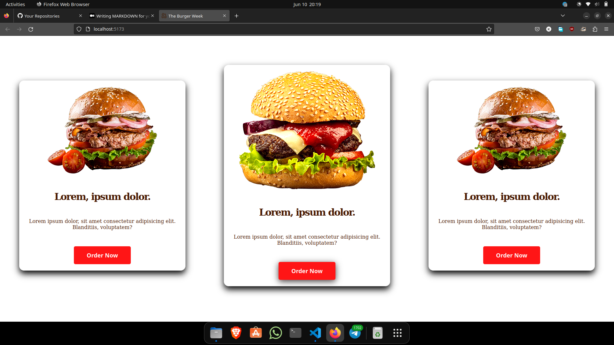
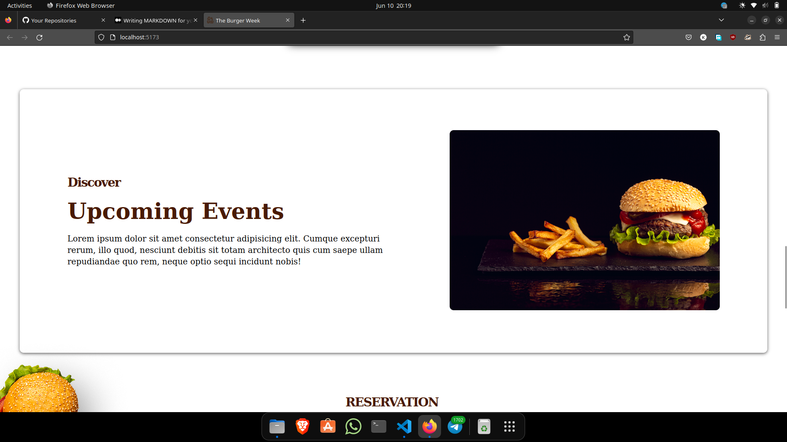
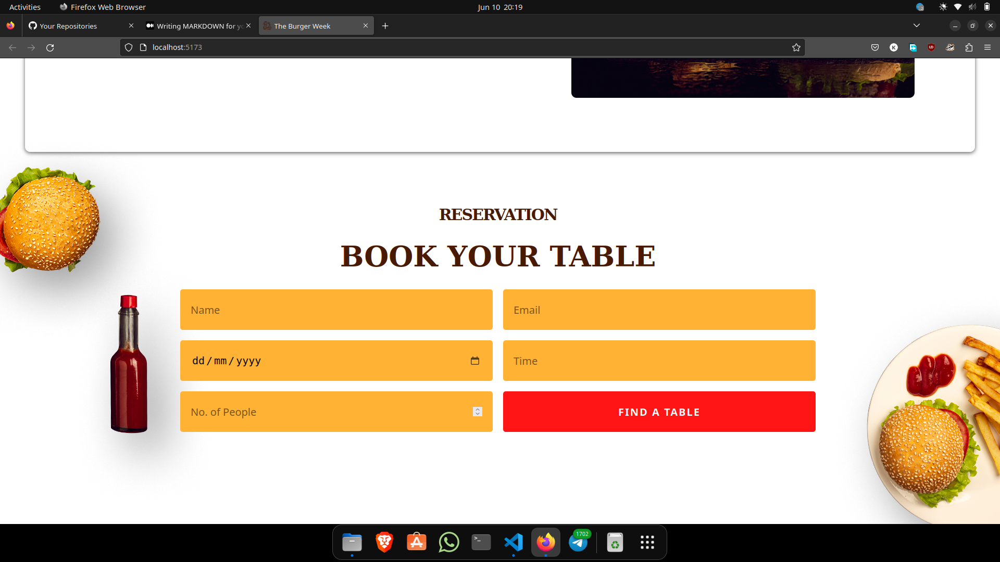
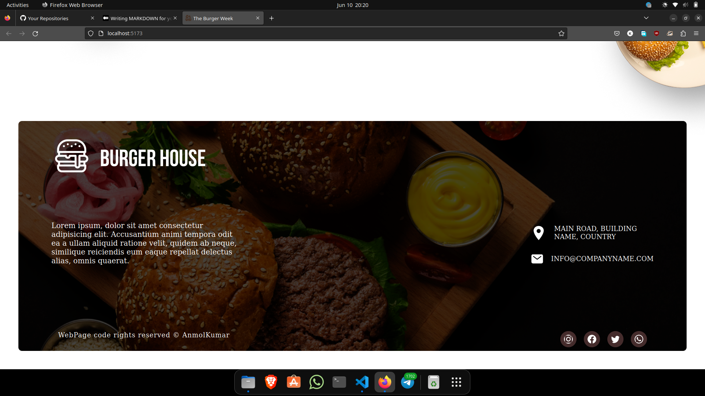
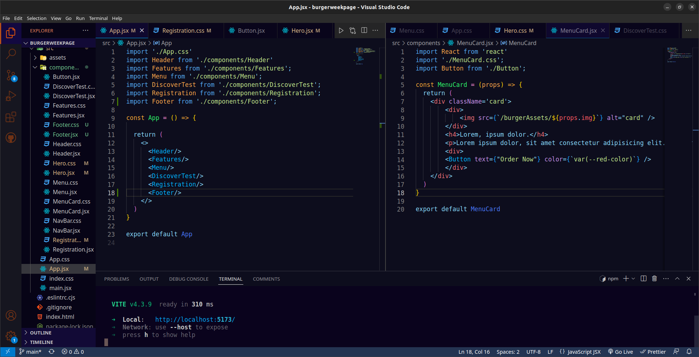

# PSD to HTML with React

This is a project that demonstrates the conversion of a PSD (Photoshop) design file into a fully functional website using React. The goal of this project is to showcase my skill og converting a static design into dynamic web pages using React components.

## Project Overview

The project involves the following steps:

1. **PSD Design**: Start with a PSD design file that represents the desired look and layout of the website.
2. **Slice PSD**: Break down the PSD design into smaller components (such as headers, footers, navigation bars, etc.) to make it easier to implement and manage.
3. **HTML/CSS**: Convert the sliced components into HTML and CSS code, ensuring that the layout and styling match the design.
4. **React Components**: Create React components for each sliced component, making them reusable and modular.
5. **Responsive Design**: Implement responsive design principles to ensure the website looks good and functions well across different devices and screen sizes, Though I haven't made it responsive hehe.

## Technologies Used

The following technologies were used in this project:

- React: A JavaScript library for building user interfaces.
- HTML: Markup language used for structuring the web page content.
- CSS: Styling language used for designing the website's appearance.
- JavaScript: Programming language used for interactivity and functionality.
- PSD Editing Software: Adobe Photoshop for slicing the PSD file.

## Getting Started

To get started with this project, follow these steps:

1. Clone the repository: `git clone https://github.com/Anmol8611/burgerweekpage.git`
2. Navigate to the project directory: `cd burgerweekpage`
3. Install dependencies: `npm install`
4. Start the development server: `npm run dev`
5. Open your browser and visit: `http://localhost:5173`

## Folder Structure

The project's folder structure is organized as follows:

psd-to-html-react/
|- src/
|- components/ # React components # Style components
|- burgerAssets/ # Images, fonts, etc.
|- App.js # Main React component
|- index.js # Entry point
|- public/ # Public assets
|- README.md # Project documentation  

## Screenshots

## Acknowledgments

Special thanks to the creators of React and the PSD editing software used in this project.

## Contact

If you have any questions or need further assistance, please contact [https://twitter.com/Anmol_kr_twt].

Enjoy building your PSD to HTML with React project!
